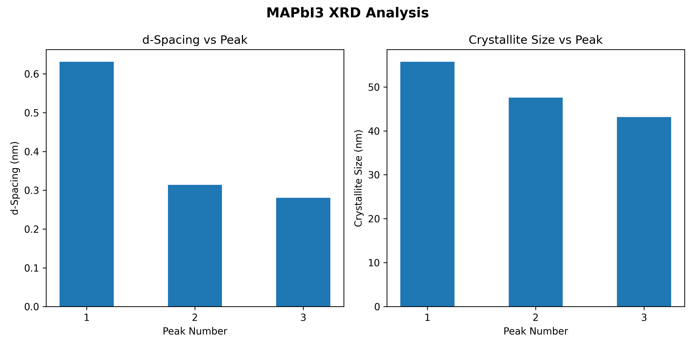

# 🔬 MAPbI₃ XRD Analysis

Structural characterization of Methylammonium Lead Iodide (MAPbI₃) perovskite using X-ray diffraction (XRD) analysis. This project demonstrates how Python can be used to extract structural parameters from diffraction peak data using **Bragg's Law** and the **Scherrer Equation**. The results are visualized using Python and Matplotlib.

---

## Theory

### Bragg's Law

**d = λ / (2 sin θ)**

| Symbol | Meaning             |
| ------ | ------------------- |
| **d**  | Interplanar spacing |
| **λ**  | X-ray wavelength    |
| **θ**  | Diffraction angle   |

### Scherrer Equation
**D = (Kλ) / (β cos θ)**


| Symbol | Meaning                           |
| ------ | --------------------------------- |
| **D**  | Crystallite size                  |
| **K**  | Shape factor (0.94)               |
| **λ**  | X-ray wavelength                  |
| **β**  | Full Width at Half Maximum (FWHM) |
| **θ**  | Diffraction angle                 |

### Constants

* **X-ray source:** Cu Kα radiation
* **Wavelength (λ):** 0.15406 nm
* **Shape factor (K):** 0.94

---

## Workflow

```text
Input XRD Peak Data
        │
        ▼
Apply Bragg's Law
        │
        ▼
Calculate d-spacing
        │
        ▼
Apply Scherrer Equation
        │
        ▼
Estimate Crystallite Size
        │
        ▼
Visualize Results
```

---

## Results

### Input Data

| Peak | 2θ (°) | FWHM (°) |
| ---- | ------ | -------- |
| 1    | 14.02  | 0.15     |
| 2    | 28.42  | 0.18     |
| 3    | 31.85  | 0.20     |

### Calculated Results

| Peak | d-spacing (nm) | Crystallite Size (nm) |
| ---- | -------------- | --------------------- |
| 1    | 0.6312         | 55.73                 |
| 2    | 0.3138         | 47.55                 |
| 3    | 0.2807         | 43.14                 |

The calculated d-spacing values agree well with reported values for the characteristic diffraction planes of tetragonal MAPbI₃. The estimated crystallite sizes range from approximately **43–56 nm**, indicating the polycrystalline nature of the material.

## XRD Analysis Plot



---

## Features

* Calculates interplanar d-spacing using Bragg's Law
* Estimates crystallite size using the Scherrer Equation
* Processes multiple diffraction peaks
* Generates graphical visualization with Matplotlib
* Clean and well-documented Python implementation

---

## Repository Structure

```text
MAPbI3_XRD_Analysis/
│
├── XRD_Analysis.py
├── XRD_Plot.py
├── xrd_plot.png
└── README.md
```

---

## Installation

Install the required package:

```bash
pip install matplotlib
```

---

## Usage

### Run the structural analysis

```bash
python XRD_Analysis.py
```

Outputs the calculated interplanar spacing and crystallite size for each diffraction peak.

### Generate the visualization

```bash
python XRD_Plot.py
```

Creates and saves the output figure as:

```text
xrd_plot.png
```

---

## Future Improvements

* Read XRD peak data directly from CSV files
* Automatic peak detection
* Miller index assignment
* Williamson–Hall analysis
* Comparison with reported literature values
* Error propagation and uncertainty analysis
* Support for experimental XRD datasets
* Interactive plotting using Plotly

---

## License

This project is licensed under the MIT License. See the `LICENSE` file for details.

---

## Author

**Sobia Asghar**

BS Physics, The Islamia University of Bahawalpur, Pakistan

GitHub: https://github.com/Sobia945

